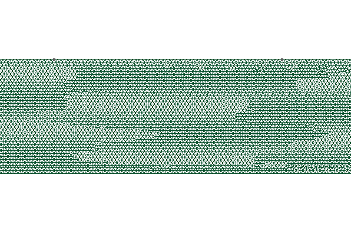

# bsc-ilia-fedotov  
  

to run the simulations, please create a conda enviroment containing DOLFINx, as described here:
https://github.com/FEniCS/dolfinx
# circular obstacle simulation
The parametric study for radial obstacle is located at  
[sim_mpi.py](conda/mpi_run/01_radial_parametric_simulation/sim_mpi.py)  
and can be run with  
mpirun -n 4 python3 sim_mpi.py --mode loop --save 1 --length 10 --pressure_range 500 600 10 --radius_range 0.01 0.3 10
# Membrane ODE implementation and tests
The initial development notebook and results with a membrane obstacle are located at   
[02_zeta_function](conda/mpi_run/02_zeta_function)   
# membrane obstacle simulation  
The parametric study for iterative membrane simulations is located at  
[sim_mpi_iterative.py](conda/mpi_run/03_membrane_parametric_simulation/sim_mpi_iterative.py)  
and can be run with  
mpirun -np 4 python3 sim_mpi_iterative.py --save 0 --single 1 --tol 0.03
# Results, camparison, databases  
The results of the parametric runs are located in a dtool database at  
[dtool_db](conda/mpi_run/04_dtool_db)  
The jupyter files to create plots are located at     
[compare_plots](conda/mpi_run/05_compare_plots)  
sorted by radial, membrane simulations and the comparisson thereof.  
# Plots
All generated plots were moved to  
[05_plots_used_in_thesis_pdf](conda/mpi_run/06_plots_used_in_thesis_pdf) 
# A reference solution
A reference solution is provided at  
[06_reference_solution_by_j_hoermann](conda/mpi_run/07_reference_solution_by_j_hoermann)
# Timing test for DOLFINx FEM simulation
A timing test was run using our code, the notebook is located at
[timed_testrun_with_mpi](conda/timed_testrun_with_mpi)

